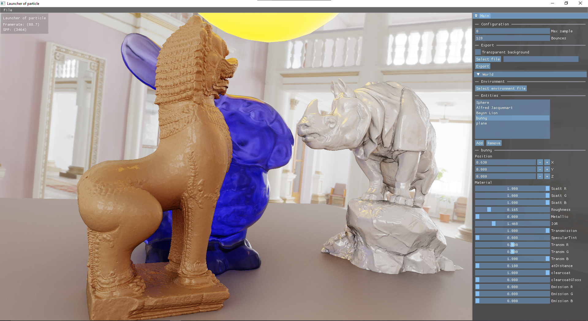

# Launcher of particle

Path-Tracing engine mainly to test high quality rendering algorithms based on [Vazteran](https://github.com/PlathC/Vazteran).

## Current state

The engine can currently render a mesh with an hardcoded lambertian diffuse material with environment
map multiple importance sampling. The current goal is to clean up the API to allow more configuration.



## Build

The project relies on submodules for its dependencies, it can thus be clone with:
```
git clone --recurse-submodules https://github.com/PlathC/ParticleThrowing.git
```

The CMakeLists file can be used as follow:
```
cd ParticleThrowing
mkdir out
cmake -S . -B out
cmake --build out --target PTOOnline --config "Release"
```